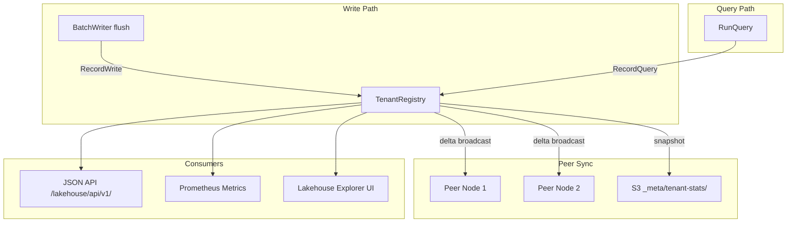
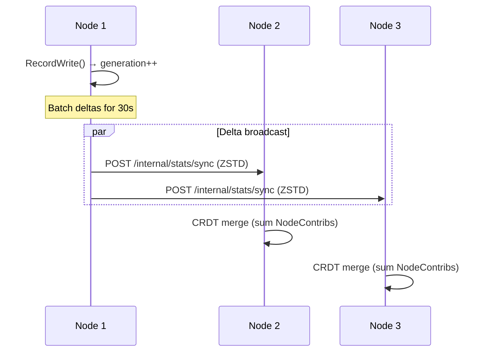
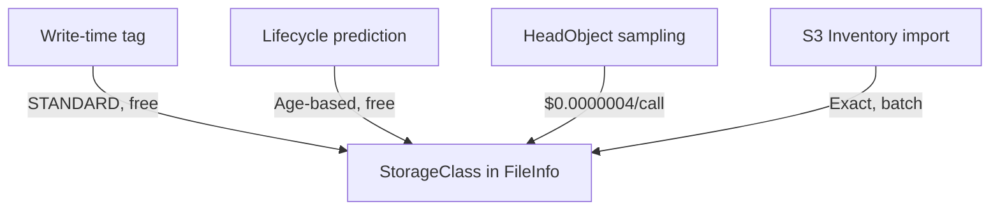

# Tenant Statistics & Storage Metrics

Victoria Lakehouse tracks per-tenant and global storage statistics in real-time, with CRDT-based fleet synchronization, S3 storage class awareness, and cost estimation.

## Architecture Overview



## TenantRegistry

The `TenantRegistry` is an in-memory data structure tracking per-tenant statistics. It is updated on every write (manifest `AddFile`) and query (`RunQuery`), and synchronized across the fleet via CRDT peer broadcast.

### CRDT Merge Strategy

All nodes converge to the same state without coordination:

| Field | Merge Strategy | Rationale |
|-------|---------------|-----------|
| TotalFiles, TotalBytes, RawBytes, TotalRows | Sum of NodeContribs per node | Each node only increments its own counter |
| MinTimeNs | Min across all nodes | Earliest data wins |
| MaxTimeNs | Max across all nodes | Latest data wins |
| LastWriteAt, LastQueryAt | Max across all nodes | Most recent activity wins |
| Labels (cardinality) | Max per field | Cardinality only grows or is recomputed |
| BytesByClass, FilesByClass | Sum of NodeContribs per class+node | Per-node tracking |

### Tenant Isolation Modes

| Mode | S3 Layout | Discovery | Config |
|------|-----------|-----------|--------|
| **Prefix** (default) | `s3://{bucket}/{AccountID}/{ProjectID}/logs/dt=.../` | S3 ListObjects with CommonPrefixes | `tenant.isolation: prefix` |
| **Bucket** | `s3://obs-{AccountID}-{ProjectID}/logs/dt=.../` | `tenant.known_tenants` list + HeadBucket | `tenant.isolation: bucket` |

Prefix mode is zero-config (tenants auto-discovered from S3 key prefixes). Bucket mode requires declaring tenants in config but provides full IAM isolation.

## Peer Synchronization

### Delta Broadcast

Nodes broadcast only changed tenant stats to peers at configurable intervals (default 30s). Deltas are ZSTD-compressed to minimize bandwidth.



### S3 Snapshots

Periodic full-state snapshots persist to S3 for crash recovery:

- **Prefix mode:** `s3://{bucket}/_meta/tenant-stats/{nodeID}.json.zst`
- **Bucket mode:** `s3://{primary-bucket}/_meta/tenant-stats/{nodeID}.json.zst`

On startup, the registry loads the latest snapshot, then receives live deltas.

## Storage Class Tracking

Four detection layers, from cheapest to most authoritative:



1. **Write-time tagging** — files always written as STANDARD (free)
2. **Lifecycle prediction** — predict class from file age vs configured transition rules (free)
3. **HeadObject sampling** — spot-check files near transition boundaries (capped per cycle)
4. **S3 Inventory import** — optional exact verification from CSV manifests

### Lifecycle Rules Configuration

```yaml
lakehouse:
  stats:
    s3_lifecycle_rules:
      - transition_days: 30
        storage_class: STANDARD_IA
      - transition_days: 90
        storage_class: GLACIER
      - transition_days: 365
        storage_class: DEEP_ARCHIVE
```

Per-tenant overrides are supported in bucket-isolation mode via `tenant.known_tenants[].lifecycle_rules`.

## Cost Estimation

Cost is estimated from storage class pricing and request counts:

```
Monthly cost = Σ (bytes_in_class × price_per_gb / GB) + Σ (requests × price_per_1000 / 1000)
```

Default AWS us-east-1 pricing:

| Storage Class | $/GB/month |
|---------------|-----------|
| STANDARD | $0.023 |
| STANDARD_IA | $0.0125 |
| GLACIER_IR | $0.004 |
| GLACIER | $0.0036 |
| DEEP_ARCHIVE | $0.00099 |

## API Endpoints

All endpoints serve JSON under `/lakehouse/api/v1/`. No authentication required (internal use).

### GET /lakehouse/api/v1/tenants

List all tenants with summary statistics.

**Query parameters:**
- `sort` — Sort field: `bytes` (default), `files`, `cost`, `rows`

**Response:**
```json
{
  "tenants": [
    {
      "account_id": "100",
      "project_id": "1",
      "name": "prod-team-eu_staging",
      "isolation": "prefix",
      "bucket": "obs-archive",
      "prefix": "100/1/logs/",
      "total_files": 1247,
      "total_bytes": 52428800000,
      "raw_bytes": 262144000000,
      "total_rows": 50000000,
      "compression_ratio": 5.0,
      "partitions": 720,
      "min_time": "2026-01-01T00:00:00Z",
      "max_time": "2026-05-13T12:00:00Z",
      "last_write_at": "2026-05-13T12:00:00Z",
      "last_query_at": "2026-05-13T11:55:00Z",
      "estimated_cost_usd": 1.21,
      "bytes_by_class": {"STANDARD": 5242880000, "GLACIER": 47185920000}
    }
  ],
  "global": {
    "total_tenants": 15,
    "total_files": 18500,
    "total_bytes": 785432000000,
    "estimated_cost_usd": 18.06
  }
}
```

### GET /lakehouse/api/v1/tenants/{accountID}/{projectID}

Tenant drill-down with partition breakdown. Also accepts alias-based lookup:

```
GET /lakehouse/api/v1/tenants/prod-team-eu_staging
```

If the path segment contains non-digit characters, it is treated as an alias and resolved via the TenantResolver.

**Response:**
```json
{
  "tenant": { "...same as list entry..." },
  "partitions": [
    {"date": "2026-05-13", "hours": [0,1,2,3], "files": 48, "bytes": 524288000}
  ],
  "file_size_histogram": {
    "buckets": ["<1MB", "1-10MB", "10-50MB", "50-128MB", ">128MB"],
    "counts": [12, 245, 890, 95, 5]
  },
  "bytes_by_class": {"STANDARD": 5242880000, "STANDARD_IA": 2621440000, "GLACIER": 44564480000},
  "top_labels": [
    {"field": "service.name", "cardinality": 45},
    {"field": "k8s.namespace.name", "cardinality": 12}
  ]
}
```

### GET /lakehouse/api/v1/stats/overview

Global storage summary.

**Response:**
```json
{
  "total_files": 18500,
  "total_bytes": 785432000000,
  "raw_bytes": 3927160000000,
  "compression_ratio": 5.0,
  "total_rows": 750000000,
  "total_partitions": 10800,
  "oldest_data": "2025-06-01T00:00:00Z",
  "newest_data": "2026-05-13T12:00:00Z",
  "total_tenants": 15,
  "bytes_by_class": {"STANDARD": 78543200000, "STANDARD_IA": 392716000000, "GLACIER": 314172800000},
  "estimated_monthly_cost_usd": 18.06,
  "fleet_nodes": 3,
  "fleet_registry_generation": 45892
}
```

### GET /lakehouse/api/v1/stats/ingestion

Temporal ingestion statistics.

**Query parameters:**
- `period` — Aggregation: `hour` (default), `day`, `month`
- `range` — Time range: `24h` (default), `7d`, `30d`, `90d`, `1y`
- `tenant` — Optional tenant filter (e.g., `100/1`)

**Response:**
```json
{
  "period": "hour",
  "range": "24h",
  "buckets": [
    {"timestamp": "2026-05-13T00:00:00Z", "rows": 2500000, "bytes": 1073741824, "files": 12, "compression_ratio": 4.8},
    {"timestamp": "2026-05-13T01:00:00Z", "rows": 2700000, "bytes": 1157627904, "files": 13, "compression_ratio": 5.1}
  ]
}
```

### GET /lakehouse/api/v1/stats/cost

Cost breakdown with lifecycle savings and projections.

**Query parameters:**
- `range` — Projection range: `30d` (default)
- `tenant` — Optional tenant filter

**Response:**
```json
{
  "current_monthly_usd": 18.06,
  "by_class": [
    {"class": "STANDARD", "bytes": 78543200000, "cost_usd": 1.81},
    {"class": "STANDARD_IA", "bytes": 392716000000, "cost_usd": 4.91},
    {"class": "GLACIER", "bytes": 314172800000, "cost_usd": 1.13}
  ],
  "request_costs_usd": 0.45,
  "lifecycle_savings_usd": 12.50,
  "lifecycle_savings_pct": 40.8,
  "by_tenant": [
    {"tenant": "100/1", "cost_usd": 1.21, "pct": 6.7}
  ],
  "projection_30d_usd": 19.20,
  "projection_90d_usd": 21.50
}
```

### GET /lakehouse/api/v1/stats/compression

Compression ratio trends.

**Query parameters:**
- `period` — `day` (default), `month`
- `range` — `30d` (default)

**Response:**
```json
{
  "period": "day",
  "range": "30d",
  "buckets": [
    {"date": "2026-05-13", "avg_ratio": 5.0, "p50_ratio": 4.8, "p99_ratio": 7.2}
  ],
  "best_tenant": {"tenant": "100/1", "ratio": 6.8},
  "worst_tenant": {"tenant": "200/5", "ratio": 2.1}
}
```

### GET /lakehouse/api/v1/cardinality/fields

Field cardinality explorer.

**Query parameters:**
- `tenant` — Optional, omit for global
- `sort` — `cardinality` (default), `name`
- `limit` — Max fields returned (default 100)

**Response:**
```json
{
  "fields": [
    {"name": "service.name", "cardinality": 45, "type": "string", "has_bloom": true, "origin": "promoted", "high_cardinality": false},
    {"name": "trace_id", "cardinality": 50000000, "type": "string", "has_bloom": true, "origin": "promoted", "high_cardinality": true}
  ],
  "high_cardinality_warnings": [
    {"field": "trace_id", "cardinality": 50000000, "threshold": 10000}
  ],
  "total_fields": 85
}
```

### Tenant Aliases API

CRUD endpoints for managing tenant name aliases at runtime. Changes are persisted to S3 and broadcast to all fleet nodes.

#### GET /lakehouse/api/v1/tenants/aliases

List all configured aliases (static + runtime).

**Response:**
```json
{
  "aliases": [
    {"org_id": "prod-team-eu_staging", "account_id": 42, "project_id": 3, "source": "config"},
    {"org_id": "prod-team-eu_prod", "account_id": 42, "project_id": 7, "source": "config"},
    {"org_id": "staging_analytics", "account_id": 50, "project_id": 1, "source": "runtime"}
  ]
}
```

#### POST /lakehouse/api/v1/tenants/aliases

Create or update a runtime alias. Static config aliases cannot be overridden.

**Request:**
```json
{
  "org_id": "staging_analytics",
  "account_id": 50,
  "project_id": 1
}
```

**Response:** `201 Created` or `200 OK` (update)

#### DELETE /lakehouse/api/v1/tenants/aliases/{orgId}

Remove a runtime alias. Static config aliases cannot be deleted.

**Response:** `204 No Content`

### POST /internal/stats/sync

Internal peer sync endpoint (Bearer auth required).

**Request body:** ZSTD-compressed `TenantDelta` JSON
**Response:** `204 No Content`

## Prometheus Metrics

### Per-Tenant Metrics

Subject to cardinality cap (`stats.metrics_cardinality_limit`, default 100). When the cap is reached, new tenants are tracked in the API but not emitted as Prometheus metrics.

| Metric | Type | Description |
|--------|------|-------------|
| `lakehouse_tenant_files{tenant}` | Gauge | Current file count |
| `lakehouse_tenant_bytes{tenant}` | Gauge | Compressed bytes on S3 |
| `lakehouse_tenant_raw_bytes{tenant}` | Gauge | Uncompressed bytes |
| `lakehouse_tenant_rows_total{tenant}` | Counter | Cumulative rows ingested |
| `lakehouse_tenant_ingestion_bytes_total{tenant}` | Counter | Cumulative bytes ingested |
| `lakehouse_tenant_queries_total{tenant}` | Counter | Cumulative queries |
| `lakehouse_tenant_last_write_timestamp{tenant}` | Gauge | Unix seconds of last write |
| `lakehouse_tenant_last_query_timestamp{tenant}` | Gauge | Unix seconds of last query |

### Global Storage Metrics

Always emitted, no tenant label.

| Metric | Type | Description |
|--------|------|-------------|
| `lakehouse_storage_files_total` | Gauge | Total files across all tenants |
| `lakehouse_storage_bytes_total` | Gauge | Total compressed bytes |
| `lakehouse_storage_raw_bytes_total` | Gauge | Total uncompressed bytes |
| `lakehouse_storage_compression_ratio` | Gauge | Global average compression ratio |
| `lakehouse_storage_rows_total` | Gauge | Total rows |
| `lakehouse_storage_partitions_total` | Gauge | Total partitions |
| `lakehouse_storage_oldest_data_seconds` | Gauge | Unix timestamp of oldest data |
| `lakehouse_storage_newest_data_seconds` | Gauge | Unix timestamp of newest data |
| `lakehouse_storage_tenants_total` | Gauge | Number of active tenants |
| `lakehouse_storage_bytes_by_class{class}` | Gauge | Bytes per storage class |
| `lakehouse_storage_files_by_class{class}` | Gauge | Files per storage class |
| `lakehouse_storage_cost_monthly_usd` | Gauge | Estimated monthly cost |
| `lakehouse_storage_cost_by_class_usd{class}` | Gauge | Cost per storage class |
| `lakehouse_storage_ingestion_rate_bytes` | Gauge | Rolling ingestion rate (bytes/sec) |

### Cardinality Limiter Meta-Metrics

| Metric | Type | Description |
|--------|------|-------------|
| `lakehouse_metrics_cardinality_limit` | Gauge | Configured cap |
| `lakehouse_metrics_cardinality_tracked` | Gauge | Current unique tenants tracked |
| `lakehouse_metrics_cardinality_overflow_total` | Counter | Tenants dropped due to cap |

### Stats Sync Metrics

| Metric | Type | Description |
|--------|------|-------------|
| `lakehouse_stats_push_total` | Counter | Delta broadcasts sent |
| `lakehouse_stats_push_errors_total` | Counter | Failed broadcasts |
| `lakehouse_stats_push_bytes_total` | Counter | Bytes transmitted |
| `lakehouse_stats_snapshot_total` | Counter | S3 snapshots written |
| `lakehouse_stats_snapshot_errors_total` | Counter | Failed snapshots |
| `lakehouse_stats_merges_total` | Counter | CRDT merge operations |
| `lakehouse_stats_headobject_total` | Counter | HeadObject verification calls |

## Configuration Reference

All options under `--lakehouse.stats.*` and `--lakehouse.ui.*`:

### Stats Config

| Flag | Default | Description |
|------|---------|-------------|
| `stats.enabled` | `true` | Master switch for stats collection |
| `stats.push_interval` | `30s` | Peer delta broadcast interval |
| `stats.push_compression` | `true` | ZSTD compress deltas |
| `stats.snapshot_interval` | `5m` | S3 snapshot persistence interval |
| `stats.snapshot_prefix` | `_meta/tenant-stats` | S3 key prefix for snapshots |
| `stats.meta_bucket` | (none) | Dedicated meta bucket (bucket mode) |
| `stats.max_delta_count` | `1000` | Force full sync after N deltas |
| `stats.metrics_cardinality_limit` | `100` | Max tenant label values (0=disable) |
| `stats.cardinality_warning_threshold` | `10000` | High-cardinality field warning |
| `stats.s3_lifecycle_rules` | (none) | S3 lifecycle rules for class prediction |
| `stats.s3_price_per_gb` | AWS defaults | Per-class pricing ($/GB/month) |
| `stats.s3_request_prices` | AWS defaults | Per-1000-request pricing |
| `stats.s3_inventory_bucket` | (none) | S3 Inventory source bucket |
| `stats.headobject_sample_interval` | `6h` | HeadObject spot-check interval |
| `stats.headobject_max_per_refresh` | `50` | Max HeadObject calls per cycle |

### UI Config

| Flag | Default | Description |
|------|---------|-------------|
| `ui.enabled` | `true` | Serve /lakehouse/ui/ endpoint |
| `ui.vmui_tab` | `true` | Inject Lakehouse tab into VMUI |
| `ui.refresh_default` | `0` | Auto-refresh seconds (0=off) |
| `ui.theme` | `auto` | Theme: auto, dark, light |

### Tenant Config (extended)

| Flag | Default | Description |
|------|---------|-------------|
| `tenant.known_tenants` | (none) | Tenant list for bucket-isolation cold discovery |
| `tenant.known_tenants[].lifecycle_rules` | (none) | Per-tenant lifecycle override |
| `tenant.known_tenants[].price_per_gb` | (none) | Per-tenant pricing override |
