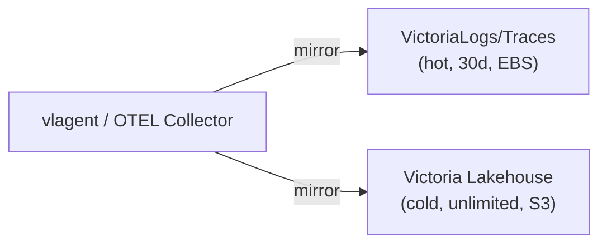
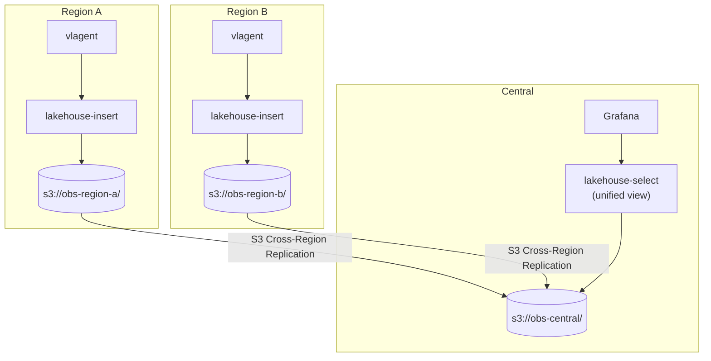

# Use Cases

Victoria Lakehouse addresses several operational, compliance, and analytical needs that go beyond standard hot-tier observability storage.

## 1. Long-Term Observability Storage

**Problem**: Hot VictoriaLogs/VictoriaTraces clusters on EBS become prohibitively expensive for retention beyond 30 days. At 500 GB/day ingestion, 1 year of EBS storage across 3 AZs costs ~$6,700/month.

**Solution**: Mirror data to Victoria Lakehouse on S3. S3 is inherently multi-AZ (11 nines durability) at $0.023/GB — 3-6x cheaper than EBS.



**Typical retention policy:**

| Tier | Storage | Retention | Query Latency | Cost/GB |
|---|---|---|---|---|
| Hot | EBS gp3 (multi-AZ) | 30 days | <10ms | $0.08-0.24/GB |
| Cold | S3 Standard | 1-3 years | 50-500ms | $0.023/GB |
| Archive | S3 Glacier | 3+ years | minutes-hours | $0.004/GB |

**Query experience**: Users query Grafana normally. vlselect/vtselect fans out to both hot vlstorage and cold lakehouse-select. The hot boundary auto-discovery ensures lakehouse returns empty for recent data (0ms), and only processes queries for data outside the hot tier's range.

## 2. Disaster Recovery (DR)

**Problem**: If the hot VictoriaLogs/VictoriaTraces cluster goes down (hardware failure, Kubernetes issue, cloud AZ outage), all observability data becomes inaccessible — exactly when you need it most.

**Solution**: Victoria Lakehouse on S3 serves as a warm standby. Since data is mirrored in real-time, the lakehouse has a near-complete copy of all data.

**DR guarantees:**

| Aspect | Guarantee |
|---|---|
| Data completeness | All data since lakehouse deployment (minus unflushed buffer — typically <10s) |
| Failover time | Seconds (update Grafana datasource or vmauth routing) |
| Query coverage | All historical data available |
| Query latency | 50-500ms (vs <10ms from hot tier) |
| Durability | S3: 99.999999999% (11 nines) |

**Failover mechanisms:**
- **vmauth**: Configure `first_available` load balancing with hot cluster primary, lakehouse fallback
- **Grafana**: Switch datasource URL from vlselect to lakehouse-select
- **DNS**: Update service endpoint to point at lakehouse

See [Deployment Architecture — Disaster Recovery](deployment-architecture.md#disaster-recovery) for detailed configuration.

## 3. Maintenance Window Coverage

**Problem**: Upgrading VictoriaLogs/VictoriaTraces (version bumps, schema migrations, storage compaction, Kubernetes node upgrades) requires downtime or rolling restarts. During this window, queries fail or return incomplete results.

**Solution**: Route all queries to lakehouse during maintenance. Users experience slower queries (S3-backed) but continuous access to all data.

**Maintenance workflow:**

1. Verify lakehouse data coverage: `curl lakehouse-select:9428/manifest/range`
2. Route Grafana/vmauth to lakehouse-select exclusively
3. Perform hot cluster maintenance (upgrade, compaction, migration)
4. Verify hot cluster health: `curl vlselect:9428/health`
5. Restore normal routing (vlselect → vlstorage + lakehouse)
6. Verify hot+cold fan-out works

**Zero-downtime upgrades**: With lakehouse as fallback, hot cluster upgrades can be performed during business hours without affecting dashboard availability.

## 4. Open Format Analytics

**Problem**: Observability data locked in proprietary formats (Loki chunks, custom time-series formats) cannot be queried by standard analytics tools. Teams that need ad-hoc analysis, compliance reporting, or ML training must export data through limited APIs.

**Solution**: Victoria Lakehouse stores everything as standard Apache Parquet on S3. Any tool that reads Parquet works out of the box.

**Supported analytics tools:**

| Tool | Use Case | Access Pattern |
|---|---|---|
| DuckDB | Ad-hoc investigation, incident response | Direct S3 Parquet reads, zero setup |
| Trino | Federated SQL, cross-source joins | Hive catalog over S3 Parquet |
| Apache Spark | Large-scale ETL, ML pipelines, batch analytics | S3A filesystem, Hive partitions |
| ClickHouse | High-performance analytical queries | S3 table function |
| Pandas | Data science, Jupyter notebooks | PyArrow + s3fs |
| AWS Athena | Serverless SQL on S3 | Glue Catalog, Hive partitions |
| Databricks | Unified analytics platform | Delta Lake compatible reads |

See [Analytics](analytics.md) for detailed configuration and query examples.

## 5. Compliance and Audit

**Problem**: Regulatory requirements (SOC2, HIPAA, PCI-DSS, GDPR) mandate specific data retention periods, audit trails, and provable data lineage. Mutable storage systems make compliance harder to prove.

**Solution**: Parquet files on S3 are immutable once written. Combined with S3 versioning, object lock, and access logging, this provides a verifiable audit trail.

**Compliance features:**

| Requirement | Implementation |
|---|---|
| Data retention | S3 lifecycle policies (e.g., 7 years for SOC2) |
| Immutability | S3 Object Lock (WORM compliance) |
| Access audit | S3 server access logging + CloudTrail |
| Data lineage | Hive partition paths encode timestamp (dt=YYYY-MM-DD/hour=HH) |
| Right to erasure (GDPR) | Query by tenant, delete specific partition files |
| Encryption at rest | S3 SSE-S3, SSE-KMS, or SSE-C |
| Encryption in transit | TLS for S3 API calls |
| Cross-region backup | S3 Cross-Region Replication |

**Compliance query example (Trino):**

```sql
-- Verify data retention: all days covered for the last 365 days
SELECT dt, COUNT(*) as records, COUNT(DISTINCT hour) as hours_covered
FROM lakehouse.observability.logs
WHERE dt >= DATE_FORMAT(DATE_ADD('day', -365, CURRENT_DATE), '%Y-%m-%d')
GROUP BY dt
ORDER BY dt;
```

## 6. Cost Allocation and Chargeback

**Problem**: Platform teams need to allocate observability costs to product teams based on their actual data volume. Real-time systems don't easily support this kind of historical analysis.

**Solution**: Query Parquet files directly to compute per-team, per-namespace, per-service data volumes.

```sql
-- Monthly log volume by namespace (DuckDB)
SELECT DATE_TRUNC('month', TO_TIMESTAMP(timestamp_unix_nano / 1000000000)) as month,
       "k8s.namespace.name" as namespace,
       COUNT(*) as log_count,
       SUM(LENGTH(body)) / (1024*1024*1024) as volume_gb
FROM read_parquet('s3://obs-archive/logs/dt=2026-*/hour=*//*.parquet',
                  hive_partitioning=true)
GROUP BY month, namespace
ORDER BY month, volume_gb DESC;
```

## 7. Capacity Planning and Forecasting

**Problem**: Teams need to predict future infrastructure needs based on historical growth patterns. Real-time dashboards show current state but not multi-month trends.

**Solution**: Analyze months of historical data in Spark or DuckDB to model growth and forecast capacity needs.

```python
# Spark: Monthly growth rate by service
growth = spark.sql("""
    WITH monthly AS (
        SELECT DATE_TRUNC('month', TO_TIMESTAMP(timestamp_unix_nano / 1e9)) as month,
               `service.name`,
               COUNT(*) as logs,
               SUM(LENGTH(body)) as bytes
        FROM logs
        WHERE dt BETWEEN '2025-06-01' AND '2026-05-01'
        GROUP BY month, `service.name`
    )
    SELECT `service.name`,
           MIN(logs) as min_monthly_logs,
           MAX(logs) as max_monthly_logs,
           AVG(logs) as avg_monthly_logs,
           (MAX(logs) - MIN(logs)) * 1.0 / NULLIF(MIN(logs), 0) as growth_pct
    FROM monthly
    GROUP BY `service.name`
    HAVING COUNT(*) >= 6
    ORDER BY growth_pct DESC
""")
```

## 8. Incident Post-Mortem and Root Cause Analysis

**Problem**: Post-incident reviews need access to logs and traces from days or weeks ago — often past the hot tier's retention window.

**Solution**: Lakehouse retains all data on S3. Engineers can query any historical period with LogsQL through Grafana, or use DuckDB/Trino for deep-dive analysis that goes beyond what dashboard queries support.

**Typical post-mortem workflow:**

1. Identify incident time range from alerting system
2. Query Grafana (VictoriaLogs datasource pointed at lakehouse) for the incident window
3. For deeper analysis, use DuckDB directly on S3:
   ```sql
   -- Find all error logs during the incident window
   SELECT timestamp_unix_nano, "service.name", body, trace_id
   FROM read_parquet('s3://obs-archive/logs/dt=2026-04-15/hour=*//*.parquet',
                     hive_partitioning=true)
   WHERE severity_text = 'ERROR'
     AND timestamp_unix_nano BETWEEN 1744713600000000000 AND 1744717200000000000
   ORDER BY timestamp_unix_nano;
   ```
4. Correlate with traces for the same time window
5. Export findings to a report

## 9. Machine Learning on Observability Data

**Problem**: ML teams want to build models for anomaly detection, log clustering, capacity prediction, and intelligent alerting. They need bulk access to historical data in a format compatible with ML frameworks.

**Solution**: Parquet is the native format for pandas, PyArrow, and Spark ML. Data is directly accessible without export pipelines.

**ML use cases:**

| Use Case | Approach | Input Data |
|---|---|---|
| Log anomaly detection | Isolation forest on log rate | Hourly log counts by service |
| Latency prediction | Regression on trace durations | Span durations + attributes |
| Error forecasting | Time series (Prophet/ARIMA) | Daily error counts by service |
| Log clustering | TF-IDF + K-means on log bodies | Log message text |
| Service health scoring | Multi-variate classification | Combined log severity + trace error rate + latency |
| Capacity forecasting | Linear regression on volume | Monthly data volume by namespace |

## 10. Multi-Region / Multi-Cloud Observability

**Problem**: Organizations with workloads in multiple regions or clouds need a unified view of observability data without shipping raw data cross-region in real-time.

**Solution**: Each region runs its own lakehouse-insert, writing to a regional S3 bucket. S3 Cross-Region Replication syncs data to a central bucket. A lakehouse-select fleet reads from the central bucket for unified queries.



## 11. Data Sharing with External Teams

**Problem**: Security teams, auditors, or business analysts need access to specific subsets of observability data without access to the production monitoring stack.

**Solution**: Grant S3 read access to specific partition paths. External teams use their preferred tools (DuckDB, Spark, Athena) directly on the Parquet files.

```json
{
  "Version": "2012-10-17",
  "Statement": [{
    "Effect": "Allow",
    "Action": ["s3:GetObject", "s3:ListBucket"],
    "Resource": [
      "arn:aws:s3:::obs-archive",
      "arn:aws:s3:::obs-archive/logs/dt=2026-05-*"
    ],
    "Condition": {
      "StringLike": {
        "s3:prefix": ["logs/dt=2026-05-*"]
      }
    }
  }]
}
```

No additional infrastructure needed — just IAM policies on the existing S3 bucket.

## 12. Testing and Development

**Problem**: Developers and QA teams need realistic observability data for testing dashboards, alerts, and analysis tools. Synthetic data is unreliable; production data access is restricted.

**Solution**: Copy specific time ranges from the lakehouse S3 bucket to a development S3 bucket. Development lakehouse instances read from the dev bucket with production-realistic data.

```bash
# Copy a week of production logs to dev bucket
aws s3 sync s3://obs-archive/logs/dt=2026-04-28/ s3://obs-dev/logs/dt=2026-04-28/ \
  --exclude "*" --include "*.parquet"

# Point dev lakehouse at dev bucket
lakehouse-logs --lakehouse.s3.bucket=obs-dev
```
