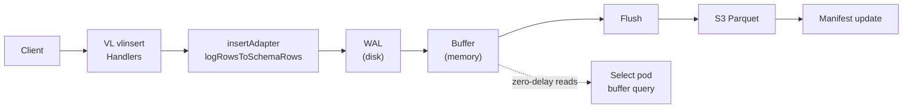

# Write Path

## Overview

Victoria Lakehouse accepts data through VL-compatible insert APIs, buffers rows in memory, and flushes them as optimally-sized Parquet files to S3. A write-ahead log (WAL) ensures crash safety, and a buffer query bridge provides zero-delay read-after-write visibility.



## Insert APIs

Victoria Lakehouse uses VictoriaLogs' native `vlinsert` handlers directly via `insertutil.SetLogRowsStorage()`. This is the same adapter pattern used on the SELECT path (`vlstorage.SetExternalStorage()`). No custom protocol parsing — Lakehouse only replaces the storage layer.

All VL-compatible insert endpoints are supported (full parity with VictoriaLogs upstream):

| Endpoint | Protocol | Use Case |
|---|---|---|
| `/insert/jsonline` | NDJSON | Native VL ingest, vlagent |
| `/insert/loki/api/v1/push` | Loki push (JSON + protobuf) | Promtail, Grafana Agent, Loki clients |
| `/insert/elasticsearch/_bulk` | ES bulk API | Filebeat, Fluentd |
| `/insert/syslog` | Syslog (RFC 5424) | rsyslog, syslog-ng |
| `/insert/journald` | systemd journal | journald export |
| `/insert/datadog/api/v2/logs` | Datadog logs API | Datadog Agent |
| `/insert/opentelemetry/v1/logs` | OTLP logs (protobuf/JSON) | OTEL Collector |
| `/insert/splunk/services/collector/event` | Splunk HEC | Splunk forwarders |
| `/insert/native` | VL native binary format | VL-to-VL replication |

Each handler is VL upstream code (unchanged). Parsed rows flow through the `insertutil.LogRowsStorage` adapter interface:

```
HTTP request
  → VL vlinsert handler (upstream, unchanged)
  → insertutil.logRowsStorage.MustAddRows(*logstorage.LogRows)
  → insertAdapter.MustAddRows → logRowsToSchemaRows → storage.MustAddLogRows
  → WAL → S3 Parquet
```

The `logRowsToSchemaRows()` function converts VL's `*logstorage.LogRows` into `[]schema.LogRow` for Parquet storage.

## Pipeline Stages

### 1. WAL (Write-Ahead Log)

Before buffering, rows are appended to the WAL on local disk. This ensures crash safety: if the process dies between receiving data and flushing to S3, the WAL replays on restart.

```yaml
lakehouse:
  insert:
    wal:
      enabled: true          # Default: true
      dir: /data/lakehouse/wal
      max_bytes: 1GB         # WAL rotation threshold
      sync_mode: fdatasync   # Durability guarantee
```

**Recovery flow:**
1. On startup, check WAL directory for uncommitted segments
2. Replay rows into memory buffers (same as normal ingest)
3. Resume flush pipeline — replayed data flushes to S3 normally
4. Truncate WAL after successful flush confirmation

### 2. Memory Buffer

Rows accumulate in per-partition memory buffers. Partition key: `dt=YYYY-MM-DD/hour=HH` (Hive layout).

```yaml
lakehouse:
  insert:
    flush_interval: 10s       # Time-based flush trigger
    flush_linger: 200ms       # Coalesce delay before flushing
    max_buffer_rows: 50000    # Per-partition row limit
    max_buffer_bytes: 256MB   # Total memory budget
    target_file_size: 128MB   # Target Parquet file size
    ack_mode: buffer          # When to ack: "buffer" or "flush-sync"
```

**Acknowledgement modes:**

| Mode | HTTP 200 After | Data at Risk | Profile |
|---|---|---|---|
| `buffer` (default) | Buffered in memory | Until next flush (10s default) | balanced, max-performance, dev |
| `flush-sync` | S3 confirms write | Zero | max-durability |

The `flush_linger` setting controls how long to wait after receiving a row before flushing, to coalesce small writes. Set to `0` for immediate flush (max-durability), `100ms` for low-latency (max-performance), or `1s` to batch aggressively (max-cost-savings).

**Flush triggers (any one fires):**
- Timer: `flush_interval` elapsed since last flush (default 10s)
- Size: partition buffer reaches estimated `target_file_size`
- Memory: total buffer memory hits `max_buffer_bytes`
- Shutdown: graceful shutdown flushes all buffers (preStop hook)

### 3. Parquet Writer

On flush, the buffer snapshot is written as a Parquet file:

1. Sort rows by timestamp within partition
2. Write Parquet with configured row group size (default 10K rows)
3. Apply ZSTD compression (default level 7, SpeedBetterCompression)
4. Generate bloom filters on `service.name` and `trace_id`
5. Compute file-level label summary (for manifest label pruning)

**Schema mapping:**
- Promoted fields (service.name, k8s.*, trace_id, etc.) → top-level Parquet columns with statistics
- Remaining fields → MAP columns (resource.attributes, log.attributes)
- All fields preserved — no data loss regardless of schema

### 4. S3 Upload

```yaml
lakehouse:
  s3:
    bucket: obs-archive
    region: us-east-1
    max_connections: 128
    retry_max: 3
    retry_base_delay: 200ms
```

**Upload path:** `s3://{bucket}/{tenant}/logs/dt=YYYY-MM-DD/hour=HH/{batch-id}.parquet`

Multipart upload for files >5MB. Single PutObject for smaller files.

### 5. Manifest Update

After successful S3 upload, `manifest.AddFile()` registers the new file:
- File path, time range (min/max timestamp), row count, byte size
- Label summary (which service.names, namespaces, etc. are in this file)
- Immediately visible to the read path — no polling delay

Select pods in the same deployment receive manifest broadcasts via headless service. Cross-deployment visibility uses SQS/SNS event notifications (optional).

## Buffer Query Bridge

Select pods discover insert pods via headless service DNS and query unflushed data through an internal HTTP API:

```
GET /internal/buffer/query?start=<ns>&end=<ns>&query=<logsql>
Response: NDJSON DataBlocks (same format as /select/logsql/query)
```

This provides zero-delay read-after-write visibility:
- Query arrives at select pod
- Select queries S3 (via manifest) for flushed data
- Select queries insert pods for buffered data
- Results merged and returned to client

In single-binary mode (`--lakehouse.role=all`), the buffer is checked locally — no network hop. The BufferBridge registers `http://localhost:<port>` as a fallback endpoint so even when peer discovery returns zero peers (single-node compose, static deployment), the bridge still fans out one request to itself. As soon as DNS discovery resolves real peers, the self-fallback steps aside so the cluster doesn't double-count the local buffer.

## Severity Text Derivation (`level` field)

VL's OTel and jsonline ingest paths emit row severity under two different field names (`severity_text` from OTLP, `level` from Loki/jsonline). The cold-tier insert path treats both as the same column. When neither is present, the writer falls back through a fixed chain:

1. Explicit `level` / `severity_text` field — wins if non-empty.
2. `severity_number` → text via VL upstream's `FormatSeverity` (re-exported through `patches/vl-logs/vl-export-severity.patch`), mapping the OTel 1–24 range to the canonical `Trace`/`Debug`/`Info`/`Warn`/`Error`/`Fatal` labels.
3. `level="X"` tag in the row's stream label set — lifted via VL's `StreamTags.Get` (re-exported through `patches/vl-logs/vl-export-streamtags-get.patch`).

If every step produces nothing the row stores `severity_text=""` rather than substituting `Unspecified`; that empty signal lets operators grep for "no severity at all" rather than confusing it with a real low-severity entry. Compaction's `mergeLogFiles` runs the same chain on the merged rows, so historical files written before the fallback existed heal as they roll up through compaction levels.

## Progressive Compression

The Parquet writer uses zstd Default (level 3) for fresh L0 flushes — optimized for ingest throughput. The compactor escalates the level on each compaction output level using a schedule keyed by output level: default `[3, 7, 11]`, mapping to zstd Default / Better / Best. Each step trades more CPU at compaction time for permanently smaller cold-tier files, so older data pays the compression cost once and saves storage forever.

Per-tenant overrides (see the Multi-tenancy doc) replace the schedule for a specific tenant — a high-volume / cost-sensitive tenant can commit more CPU than the global default; an ingest-rate-sensitive tenant can pin a uniform fast level. The `parquet-go` zstd wrapper currently exposes only four distinct encoder levels (Fastest / Default / Better / Best), so any schedule entry > 11 collapses to the same Best encoder — see `docs/architecture/parquet-compression-roadmap.md` for the planned codec swap that unlocks zstd 12-22 + long-range mode.

## Write Path Metrics

| Metric | Type | Description |
|---|---|---|
| `lakehouse_insert_rows_total` | Counter | Total rows received |
| `lakehouse_insert_rows_buffered` | Gauge | Rows pending flush |
| `lakehouse_insert_flush_total` | Counter | Flush operations completed |
| `lakehouse_insert_flush_errors_total` | Counter | Failed flushes |
| `lakehouse_insert_flush_duration_seconds` | Histogram | Flush latency |
| `lakehouse_insert_flush_bytes_total` | Counter | Bytes uploaded to S3 |
| `lakehouse_insert_partitions_active` | Gauge | Active partition buffers |
| `lakehouse_insert_wal_bytes_total` | Counter | WAL bytes written |
| `lakehouse_insert_wal_replayed_rows_total` | Counter | Rows replayed on recovery |

## Compaction

After initial flush, small files (e.g., from 10s flush intervals during low traffic) are merged by the background compactor (M9):

- **Size-tiered policy**: files <10MB in the same partition are merged into larger files
- **Only recent files**: compaction targets files from the last few hours, never touching old optimally-sized data
- **Safe for S3-IA/Glacier**: once a file reaches target size, it's never read or rewritten — lifecycle transitions are safe
- **Manifest-atomic**: old files removed from manifest only after new merged file is registered

```yaml
lakehouse:
  compaction:
    enabled: true
    min_file_size: 10MB      # Files below this are candidates
    target_file_size: 128MB  # Merge target
    max_concurrent: 2        # Parallel compaction jobs
    interval: 5m             # Check frequency
```

## Deployment Considerations

### Single Binary (role=all)

Simplest deployment. Insert + select + compaction in one process. Buffer query is local (no network). Best for <100 GB/day.

### Separate Roles (insert + select)

Scale write and read independently:
- Insert pods: scale by ingest rate (more pods = more WAL parallelism)
- Select pods: scale by query load (stateless, add replicas freely)
- Buffer query bridge connects them via headless service

### Write Amplification

Lakehouse write amplification is **1x for most data**:
- Data written once to WAL, once to S3 = 2 disk writes total
- Compaction adds ~0.2-0.5x for small files only (amortized across all data)
- Compare: Loki 3-5x (WAL + chunk + index + compaction), Tempo 2-3x

### Failure Modes

| Failure | Impact | Recovery |
|---|---|---|
| Insert pod crash | WAL intact on disk | Auto-replay on restart, zero data loss |
| S3 unreachable | Buffer grows in memory | Backpressure when max_buffer_bytes hit, retries with exponential backoff |
| Disk full (WAL) | Ingest rejects new data | Alert on `lakehouse_insert_wal_bytes_total` approaching disk capacity |
| Select pod crash | Stateless, no data | Restart, re-read manifest from disk/S3 |
